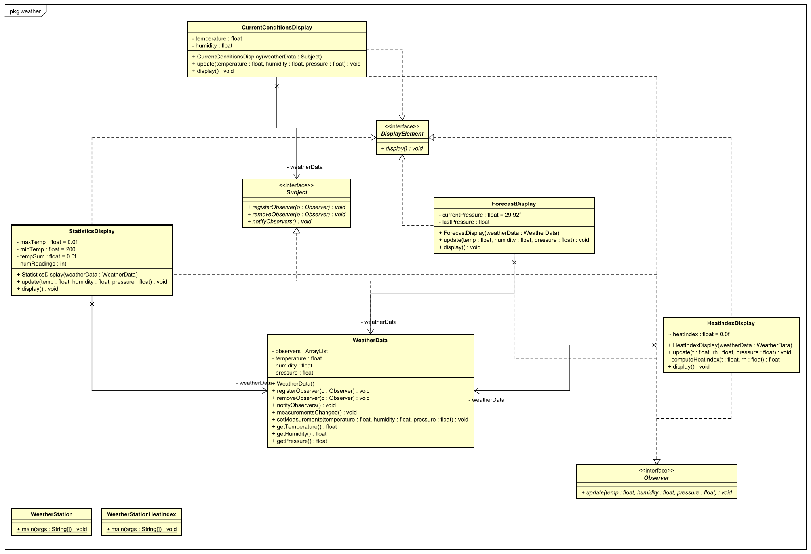

# "*Observer - WeatherData*"

## Aufgabenstellung
Die detaillierte [Aufgabenstellung](TASK.md) beschreibt die notwendigen Schritte zur Realisierung.

## Implementierung
* Runnable  
    Changed main class in `build.gradle` to `mainClassName = ' observer.weather.WeatherStation'`
* Weather Class Diagramm
    
* Commented source code
## Quellen
