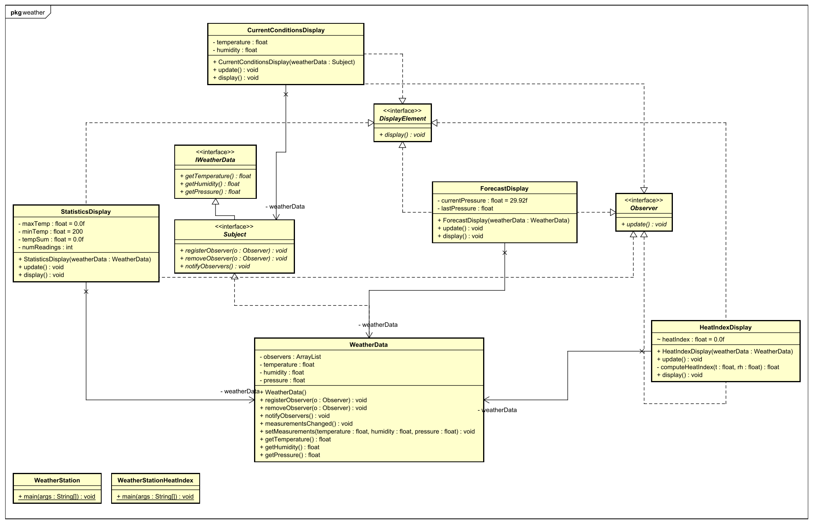

# "*Observer - WeatherData*"

## Aufgabenstellung
Die detaillierte [Aufgabenstellung](TASK.md) beschreibt die notwendigen Schritte zur Realisierung.

## Implementierung
* Runnable  
    Changed main class in `build.gradle` to `mainClassName = ' observer.weather.WeatherStation'`
* Weather Class Diagramm
    
* Commented source code
* Change to pull
    * changed Observer update method to `update();`
    * WeatherData: changed call to `observer.update();` to reflect interface changes
    * created new Interface `IWeatherData` to get WeatherData
    * inerface `Subject` extends `IWeatherData` so I do not need to change `CurrentConditionsDisplay` as much
    * Update all Displays to call thier needed methods (`getTemperature`, `getHumidity`, `getPressure`)
* Vor/Nachteile von Pull
    * Vorteile
        * Mann zwingt den Observern nicht alle Daten zu übernehmen
        * Loser gekoppelt
    * Nachteile
        * Mann muss nocheinmal beim Observer nachfragen was die Daten jetzt sind
* Updated UML
    

## Quellen
